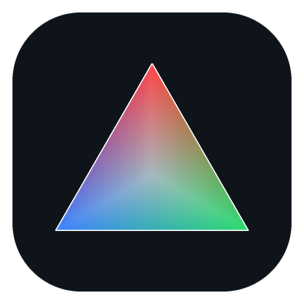

<p align="center"></p>

# Orienta — EBSD Pattern Analysis

> **Making EBSD indexing accessible**

A desktop application for **EBSD (Electron Backscatter Diffraction)** pattern
analysis: load Oxford H5OINA / EDAX H5 data, refine the pattern center, index
crystal phases (Hough / Dictionary / Spherical), integrate EDS chemistry, and
produce phase maps, grain/texture analyses, and publication figures.

Built on the [kikuchipy](https://kikuchipy.org/), [orix](https://orix.readthedocs.io/)
and [diffsims](https://diffsims.readthedocs.io/) scientific stack.

> **Status: beta (v0.2.5).** Everything listed under *Features* is reachable in the
> app, but some of it is newer than its test coverage, and a few pieces are less
> complete than their name suggests. Read
> [Known limitations](#known-limitations--to-be-done) before you rely on a result.

## Architecture

```
Electron shell        electron/main.js, electron/preload.js
      │
React frontend        frontend/  (Vite build, ~20 feature pages)
      │  HTTP + WebSocket
FastAPI backend       backend/api/  (route files under backend/api/routes/)
      │
Scientific layer      kikuchipy, orix, diffsims, numpy/scipy, PyTorch (GPU)
```

## Requirements

- **Python 3.11+** in a conda environment named `ebsd` (the packaged installer
  ships only the Electron shell — it launches a system/conda Python at runtime).
- **Node.js 20.19+** (or 22.12+) — the build toolchain (Vite 8, Vitest 4)
  requires it. Only needed to build the frontend / run it in dev.
- Optional: **WSL** with **EMsoft** / **EMSphInx** for master-pattern simulation
  and spherical indexing. You do **not** install these by hand — Orienta ships a
  wizard under **Settings → EMsoft + EMSphInx Installation** that sets up WSL,
  the Linux user and both tools. See
  [INSTALL.md § Step 5](INSTALL.md#step-5--optional-emsoft--emsphinx-via-the-built-in-installer).
  An NVIDIA GPU (CUDA 12) is optional — everything runs on the CPU without one,
  only slower. Note that `requirements.txt` currently installs the CUDA runtime
  regardless (several GB); see [Known limitations](#known-limitations--to-be-done).

## Install

> **New here?** Follow the full beginner walkthrough in **[INSTALL.md](INSTALL.md)** —
> it covers prerequisites (with download links), the Python environment, building
> the UI, both run modes, and troubleshooting, step by step.

Quick version, with conda + Node.js 18+ installed.

> **The first command is `cd`, and it is not optional.** A fresh Anaconda Prompt
> starts in your home folder, *not* in Orienta. Every command below — especially
> `pip install -r requirements.txt` — only works from the folder that contains
> `requirements.txt`. Replace the example path with wherever you unzipped or
> cloned Orienta.

```bash
# 1. Go into the Orienta folder FIRST (adjust the path to your machine):
cd C:\Users\YourName\Downloads\Orienta      # Windows
# cd ~/Downloads/Orienta                    # macOS / Linux

# 2. Confirm you are in the right place — this must list requirements.txt:
dir requirements.txt                        # Windows
# ls requirements.txt                       # macOS / Linux

# 3. Python environment
conda create -n ebsd python=3.11
conda activate ebsd
# Optimized BLAS first (NumPy is ~1000x slower on reference BLAS):
conda install -c conda-forge "blas=*=openblas"
pip install -r requirements.txt

# 4. Build the user interface (needed before first run):
cd frontend && npm install && npm run build && cd ..
```

If step 2 says the file cannot be found, you are in the wrong folder — `cd` to
the correct one before continuing.

## Run

Both run modes use the conda `ebsd` environment (the Electron desktop shell
launches the same Python backend behind the scenes).

```bash
python start_app.py        # Browser version — opens http://127.0.0.1:8000
python start_desktop.py    # Desktop version — native Electron window
```

| Mode | Command | Notes |
|------|---------|-------|
| **Browser** | `python start_app.py` | Starts the backend and opens the app at http://127.0.0.1:8000 |
| **Desktop** | `python start_desktop.py` | Native Electron window (needs Node + the frontend build) |
| Browser, headless | `python start_app.py --headless` | Backend keeps running if you close the browser — for long batches |
| Dev backend | `python -m uvicorn backend.api.main:app --host 0.0.0.0 --port 8000` | |
| Dev frontend | `cd frontend && npm run dev` (http://localhost:5173) | or `python start_app.py --dev` |
| Electron (dev) | `cd frontend && npm run electron:dev` | |

> The backend has no auto-reload — restart it after Python changes.

See **[INSTALL.md](INSTALL.md)** for prerequisites and troubleshooting.

## Tests

```bash
pytest tests/ -v          # Python backend
cd frontend && npm test   # Vitest (frontend)
```

## Features

- Load & visualize EBSD patterns (Oxford H5OINA, EDAX H5 **square grids**, EDAX
  UP1/UP2 + `.osc`; lazy load for large files)
- Pattern Center refinement (incl. pixel-wise drift correction)
- Indexing: Hough, Dictionary (CPU + GPU), Spherical (built-in GPU indexer —
  the default — or EMSphInx via WSL)
- EDS integration: element maps, Counts → Wt% → At%, chemistry-based phase suggestion
- Layered phase maps (IPF / BC / CI / EDS overlays, configurable scalebar, export)
- EBSD analysis: grain reconstruction, KAM/GOS, texture components (14, FCC/BCC
  presets) with texture index & entropy, recrystallization, Excel export
- Crystal database: CIF → .xtal conversion, Debye–Waller editor
- Simulation: EMsoft Monte-Carlo + master pattern + SHT, or an EMsoft-free GPU forward model
- HDF5 explorer (patterns, EDS maps, electron images)

## Sample data

**Crystal structures ship with the repository.** [`sample_data/phases/`](sample_data/)
contains four open-licensed (CC0, Crystallography Open Database) structures — Al,
Al₂CuMg, Al₇Cu₂Fe and α-(Al,Mn,Si) — each as `.cif`, `.xtal` and `.sht`, so you can
try Hough, Dictionary and Spherical indexing without simulating anything first. See
[`sample_data/README.md`](sample_data/README.md) for provenance and how to load them.

**EBSD measurements do not** — they are ~800 MB and are distributed with the
archived release instead (see [How to cite](#how-to-cite) for the DOI). Or simply
point the EBSD Viewer at your own H5OINA/H5 files.

## Documentation

- **Installation:** [INSTALL.md](INSTALL.md) — beginner's step-by-step setup guide.
- **User guides:** [docs/user-guide/](docs/user-guide/) — one page per app feature
  (EBSD Viewer, Indexing, PC Refinement, Pattern Match, Phase Map, EDS, Analysis,
  Crystal Database, Simulation, and more).
- **Architecture:** [docs/ARCHITECTURE.md](docs/ARCHITECTURE.md) — how the Electron
  shell, React frontend, FastAPI backend, and scientific layer fit together.
- **Per-directory READMEs:** [backend/](backend/README.md),
  [frontend/](frontend/README.md), [electron/](electron/README.md),
  [analysis/](analysis/README.md), [simulation/](simulation/README.md),
  [tools/](tools/README.md), and [docs/](docs/README.md) describe each part of
  the codebase.

## Known limitations & to be done

Orienta is beta software. This section lists what we know is missing, incomplete,
or misleading — so you find it here rather than in your results. Items marked
**wrong result** can hand you a plausible-looking answer that is not correct.

### Data and results

- **EDAX hexagonal-grid scans are not supported — and are not rejected.**
  *(wrong result)* Square-grid EDAX H5, and UP1/UP2 with an `.osc` sidecar, load
  correctly. A HexGrid scan opens as though it were a square grid, so the map comes
  out sheared. Until this is detected and refused, do not load HexGrid data.
- **The "Texture Components" map layer is empty.** The layer can be selected on
  the Analysis page but always returns a blank map. The per-component numbers in
  the texture table and the Excel export are real; only the spatial map is a stub.
- **"Texture index" and "entropy" are not computed from a true ODF.** They are
  derived from texture-component volume-fraction bins, which approximate an ODF.
  Treat them as a comparative measure between your own datasets, not as values
  comparable with MTEX or other ODF implementations. There are no pole figures on
  the Analysis page (the pole-figure tool lives on the Phase Map page).
- **Two recrystallization statistics are placeholders.** `low_gkam_fraction` and
  `low_kam_fraction` are reported as `0.0` and should be ignored. The RX fraction,
  grain counts and the high-BC fraction are computed for real.
- **Automated indexing and phase identification must be validated.** This is not a
  defect but a property of the method — see the Disclaimer below.

### Simulation

- **The EMsoft/EMSphInx simulation engine is not usable in this release.** The
  in-app installer builds EMsoft and EMSphInx correctly, but the automation module
  and configuration template that drive them are not part of this repository, so
  starting a simulation fails with a configuration error. The **EMsoft-free GPU
  forward model** is unaffected and works.
- **The installer wizard has rough edges.** On WSL 1 it asks you to run one command
  by hand. Some failures (a declined Windows elevation prompt, for instance) are
  reported as if they had succeeded, so watch the build log rather than the status
  line. If GPU simulation does not work after a successful install, check the
  OpenCL vendor files under `/etc/OpenCL/vendors/` — the wizard can leave them with
  the wrong contents.

### Installation

- **Requires Node.js 20.19+**, not 18, despite what older instructions said. The
  frontend build fails on Node 18.
- **`requirements.txt` installs the CUDA runtime even on machines without an
  NVIDIA GPU** (several GB). Everything still runs on the CPU; it is wasted
  download, not a failure.
- **Python 3.12 and 3.13 are not installable yet.** One remaining dependency
  (`pyqtdarktheme`, a leftover of the retired Qt interface) is capped below 3.12
  and aborts the install. Use Python 3.11.
- **A ZIP or Zenodo download reports its version as "unknown"** under
  *Settings → About Orienta*, because the version is read from git metadata that a
  ZIP does not carry. Clone the repository if you need the version to be visible —
  for example when reporting a problem.
- **53 of the backend tests skip** without the measurement files and crystal
  database they need; neither is distributed. The remaining 754 run offline.

### To be done

In rough priority order: refuse EDAX HexGrid files instead of mis-reading them ·
ship the simulation automation module, or remove the engine from the UI · fix the
installer's OpenCL step and make failures surface as failures · wire the texture
component map to its existing implementation and compute the two placeholder RX
statistics · move the CUDA packages behind an optional requirements file and drop
the Python 3.12 blocker · write the version into the release archive so downloads
identify themselves.

If you hit something that is not on this list, please report it — *Settings →
Report a problem* collects the logs for you; see
[docs/user-guide/ReportingProblems.md](docs/user-guide/ReportingProblems.md).

## Disclaimer

Orienta is **research software**, provided **free of charge** and **without any
warranty**, under the GNU GPL-3.0-or-later (see [LICENSE](LICENSE), §15
*Disclaimer of Warranty* and §16 *Limitation of Liability*). In particular:

- The software is provided **"as is"**; the entire risk as to its quality and
  performance is with you.
- To the maximum extent permitted by applicable law, the authors, copyright
  holders, and their institutions accept **no liability for any damages**
  arising from the use of (or inability to use) this software — including,
  without limitation, **loss of or damage to data**, inaccurate results, or any
  direct, indirect, incidental, or consequential losses.
- All processing happens **locally on your own machine**. Your data is never
  transmitted to the authors; there is no hosted service behind this
  application.
- Orienta is designed to treat your measurement files as **read-only** —
  analysis results, exports, and simulation outputs are written to separate
  files. Nevertheless, no software is free of defects: **always keep backups of
  your original data**.
- Results produced by automated indexing, phase identification, and
  quantification **must be independently validated** before you rely on them in
  publications, engineering, or any safety-relevant decisions.

## License

**GPL-3.0-or-later** — see [LICENSE](LICENSE). Third-party and derived-code
attributions are in [NOTICE.md](NOTICE.md). This project derives from GPL-3.0
code (kikuchipy), so the combined work is GPL-3.0. Use of the software is
subject to the warranty disclaimer and liability limitation above.

## How to cite

If you use this software in your research, please cite it via its **concept DOI**,
which always resolves to the most recent archived version:

> Samberger, S., Pogatscher, S., Kobayashi, E., & Weißensteiner, I. (2026). Orienta. Zenodo. https://doi.org/10.5281/zenodo.22664080

If you need to record the exact version you worked with, cite that release's own
DOI instead — every Zenodo version has one, listed on the record page.

Machine-readable citation metadata is in [CITATION.cff](CITATION.cff); GitHub's
"Cite this repository" button reads it automatically.

**Please also cite the underlying methods** when you use the corresponding features
(see [NOTICE.md](NOTICE.md) → "Algorithm / method attributions"):

- **Spherical (SHT) indexing** — Lenthe, Singh &amp; De Graef, *Ultramicroscopy* **207**,
  112841 (2019); and the [EMSphInx](https://github.com/EMsoft-org/EMSphInx) project.
  Orienta's GPU spherical indexer is an independent reimplementation of this method.
- **Hough indexing** — [PyEBSDIndex](https://github.com/USNavalResearchLaboratory/PyEBSDIndex) (U.S. NRL).
- **Dictionary indexing, simulation &amp; projection** — [kikuchipy](https://kikuchipy.org/)
  and [EMsoft](https://github.com/EMsoft-org/EMsoft).

## Funding &amp; acknowledgments

This work was supported by:

- The **European Research Council (ERC)** under the European Union's Horizon Europe
  research and innovation programme — the **HETEROCIRCAL** project (grant agreement No. **101124514**).
- The **Christian Doppler Research Association (CDG)** — **Christian Doppler
  Laboratory for Deformation-Precipitation Interactions in Aluminum Alloys** and its industrial partner(s).
- The **Canon Foundation in Europe**.

> Funded by the European Union. Views and opinions expressed are however those of
> the author(s) only and do not necessarily reflect those of the European Union or
> the European Research Council Executive Agency. Neither the European Union nor the
> granting authority can be held responsible for them.

